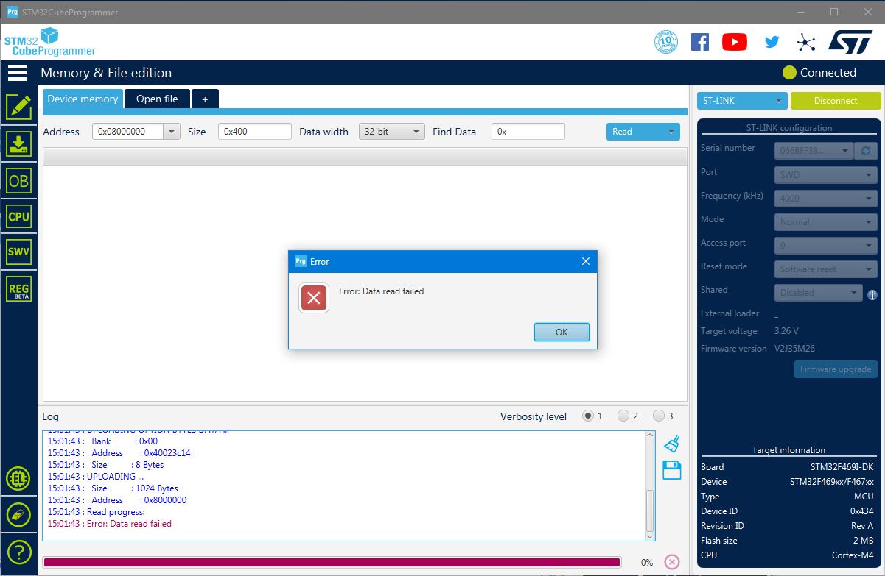
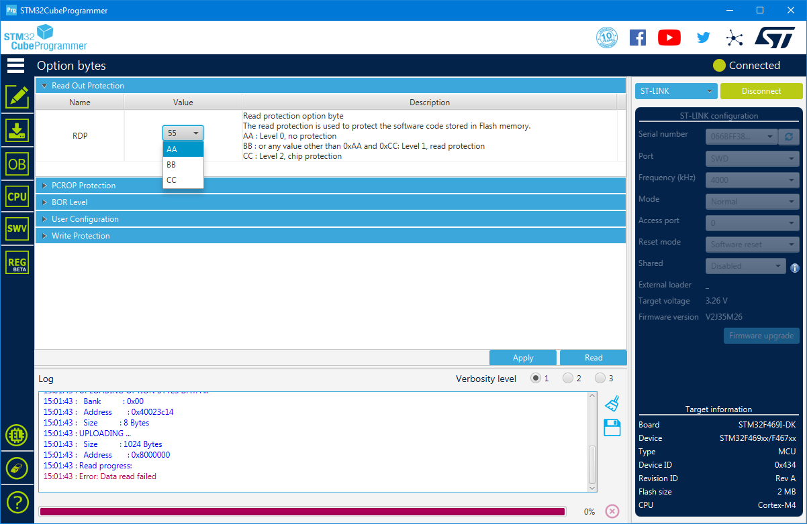

# How to remove board protections

## Using `openocd`

The root folder contains files to remove RDP and write protections on the device. Run it with:

```
openocd -f openocd.cfg -f ocd-unlock.cfg
```

## With GUI

If you have the bootloader with `READ_PROTECTION` and `WRITE_PROTECTION` enabled and you want to reset it back to normal state you need to use the [STM32CubeProgrammer](https://www.st.com/en/development-tools/stm32cubeprog.html) software. You may need to install Java for it.

Steps to disable read and write protections:

- Make sure power jumper is in the STLK position
- Connect the board with miniUSB cable
- Open STM32CubeProgrammer, click "Connect"
- The program will throw an error - it's ok, read protection prevents it from reading memory

- On the left panel click on "OB" - option bytes
- On this screen open "Read Out Protection", set to "AA" and click Apply

- Open "Write Protection", check all checkboxes. Make sure ALL checkboxes are checked (not like on the screenshot). Click Apply.

- Done, now the flash of the board is empty and unlocked.
